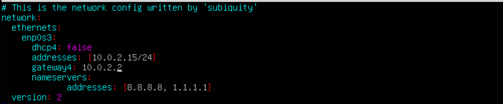
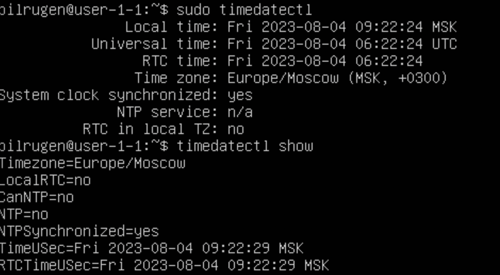
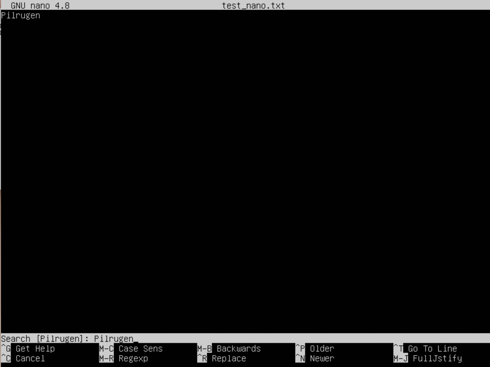
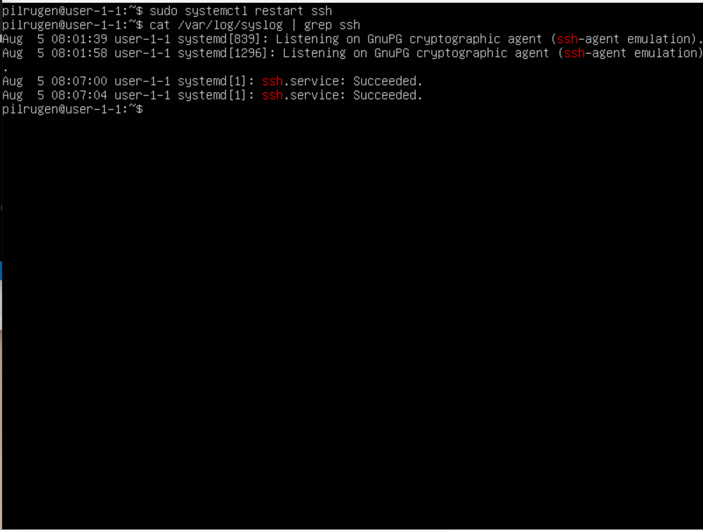

## Часть 1. Установка ОС ##

Установка Ubuntu 20.04 Server LTS без графического интерфейса.
Проверка версии командой:

`cat /etc/issue`

*рис. 1 Версия Ubuntu*

## Часть 2. Создание пользователя ##

Создание нового пользователя new_user, отличного от пользователя, который создавался при установке.
Команда для создания нового пользователя:

`sudo adduser new_user`

*рис. 2.1 Создание пользователя new_user*

Добавление пользователя new_user в группу adm.
Команда для добавления пользователя в группу adm:

`sudo usermod -a -G adm new_user`

Команда для отображения статуса пользователя:

`id new_user`

*рис. 2.2 Добавление пользователя в группу adm*

Вывод команды:

`cat /etc/passwd`

*рис. 2.3 Вывод команды `cat /etc/passwd`*

## Часть 3. Настройка сети ОС ##

Задать название машины можно с помощью команды:

`hostnamectl set-hostname user-1`

Узнать статус:

`hostnamectl status`

*рис. 3.1 Задача названия машины*

Установка временной зоны представлена на рис. 3.2 и рис. 3.3:

*рис. 3.2 Выбор географического положения*

*рис. 3.3 Выбор временной зоны*

Вывести названия сетевых интерфейсов можно с помощью команды:

`ip link show`

*рис. 3.4 Названия сетевых интерфейсов*

>Устройство loopback — это специальный виртуальный сетевой интерфейс с IP-адресом 127.0.0.1, который ваш компьютер использует для связи с самим собой. Он используется в основном для диагностики и устранения неполадок, а также для подключения к серверам, работающим на локальном компьютере.

Получение ip адреса устройства, с которого ведётся работа, от DHCP сервера представлено на рис. 3.5, с помощью команды:

`hostname -I`

*рис. 3.5 ip адрес устройства*

>DHCP (протокол динамической настройки узла) — сетевой протокол, позволяющий сетевым устройствам автоматически получать IP-адрес и другие параметры, необходимые для работы в сети TCP/IP. Данный протокол работает по модели «клиент-сервер». Для автоматической конфигурации компьютер-клиент на этапе конфигурации сетевого устройства обращается к так называемому серверу DHCP и получает от него нужные параметры. Протокол DHCP используется в большинстве сетей TCP/IP.

Для определения и вывода на экран внешнего ip-адрес шлюза необходимо естановить специальную утилиту Curl, для этого необходимо выполнить следующую команду:

`sudo apt-get install curl`

*рис. 3.6 Установка curl*

Что узнать внешний ip-адрес шлюза необходимо использовать команду `curl icanhazip.com`. Для внутреннего IP-адрес шлюза: `ip route`

*рис. 3.7 Внешний и внутренний ip-адреса*

Для того чтобы задать статичные настройки ip, gw, dns необходимо использовать команду:

`sudo vim /etc/netplan/00-installer-config.yaml`

*рис. 3.8 Статичные настройки ip, gw, dns*

Чтобы применить внесённые изменния необходимо выполнить команду:

`sudo netplan apply`

*рис. 3.9 Сохранение внесённых изменений*

После перезагруки виртуальной машины, можно убедиться что статичные сетевые настройки соответствуют настройкам заданным в предыдущем пункте с использованием команды:

`ifconfig`

*рис. 3.10 Проверка сохранённых настроек*

Пропинговать удалённые хосты 1.1.1.1 и ya.ru можно, использовав команды:

`ping 1.1.1.1` и `ping ya.ru`

*рис. 3.11 Пинг удалённый портов*

## Часть 4. Обновление ОС ##

Обновление системы до последней версии можно сделать при помощи команды:

`sudo apt-get dist-upgrade`

*рис. 4 Обновление системы*

## Часть 5. Использование команды sudo ##

>**sudo** - консольная команда выполняющая команду переданную ей как аргумент с правами суперпользователя (root). Если быть точнее, то команда sudo позволяет выполнять программы от имени любого пользователя, но, если идентификатор или имя этого пользователя не указаны, то предполагается выполнение от имени суперпользователя root. Таким образом, использование sudo позволяет выполнять привилегированные команды обычным пользователям без необходимости ввода пароля суперпользователя root

Изменение hostname OC от имени пользователя new_user, используя sudo представлено на рис. 5, с помощью команд:

`sudo hostnamectl set-hostname user-1-1`

`hostnamectl`

*рис. 5 Обновление системы*

## Часть 6. Установка и настройка службы времени ##

Настройка службы времени представлена на рис. 6.

`sudo timedatectl`

`timedatectl show`

*рис. 6 Настройка службы времени*

## Часть 7. Установка и использование текстовых редакторов ##

Для выхода с сохранением изменений в файле test_vim.txt необходимо набрать `:wq`.

*рис. 7.1 Редактирование файла в VIM*

Для выхода с сохранением изменений в файле test_nano.txt нужно набрать `Control + x` и далее ввести `Y`.

*рис. 7.2 Редактирование файла в nano*

Для выхода с сохранением изменений в файле test_mcedit.txt требуется нажать клавишу `F2` и подтвердить изменения.

*рис. 7.3 Редактирование файла в mcedit*

Изменение файла test_vim.txt, с заменой ника на "21 School 21", представлено на рис. 7.4. Для выхода без изменений нужно использовать ввод `:q!`

*рис. 7.4 Изменение файла в vim*

Изменение файла test_nano.txt, с заменой ника на "21 School 21", представлено на рис. 7.5. Для выхода без изменений нужно использовать сочетание клавиш `Control + x!` и далее ввести `N`

*рис. 7.5 Изменение файла в nano*

Изменение файла test_mcedit.txt, с заменой ника на "21 School 21", представлено на рис. 7.5. Для выхода без изменений нужно нажать клавишу `ESC` и не подтверждать изменения

*рис. 7.6 Изменение файла в mcedit*

Для поиска слова в vim необходимо ввести `/word_for_search`, где `what_for_search` то что нужно найти.

*рис. 7.7 Поиск слова в vim*

Для изменения найденного слова в vim необходиом ввести `:s/search/replace`, где `search` то что надо найти `replace` то что необходимо изменить.

*рис. 7.8 Изменение слова по поиску в vim*

Для поиска слова в nano нужно использовать сочетание клавиш `Control + W` и далее ввести искомое слово.

*рис. 7.9 Поиск слова в nano*

Для изменения слова по поиску в nano необходимо использовать сочетание клавиш `Control + \`, далее ввести искомое слово и подтвердить изменение вводом `Y`.

*рис. 7.10 Изменение слова по поиску в nano*

Для поиска слова в mcedit нужно нажать клавишу `F7` и ввести необходимое слово.

*рис. 7.11 Поиск слова в mcedit*

Для изменения слова по поиску в mcedit нужно нажать клавишу `F4` и ввести сначала слово для изменения и потом на что изменять это слово.

*рис. 7.11  Изменение слова по поиску в mcedit*

## Часть 8. Установка и базовая настройка сервиса SSHD ##

Установка службы SSHd представлена на рис. 8.1.

`sudo apt-get install ssh`

`sudo apt install openssh-server`

*рис. 8.1 Установка службы SSHd*

Добавить автостарт службы при загрузке системы можно использовав команду:

`sudo systemctl enable ssh`

*рис. 8.2 Автостарт службы*

Для изменения порта необходимо изменить конфигурационный файл в текстовом редакторе по пути /etc/ssh/sshd_config. Изменение порта представлено на рис. 8.3.

*рис. 8.3 Изменение порта*

>Команда ps вывоводит информацию об активных процессах. Флаги, которые можно использовать с ней:

* -A, -e, (a) - выбрать все процессы;
* -a - выбрать все процессы, кроме фоновых;
* -d, (g) - выбрать все процессы, даже фоновые, кроме процессов сессий;
* -N - выбрать все процессы кроме указанных;
* -С - выбирать процессы по имени команды;
* -G - выбрать процессы по ID группы;
* -p, (p) - выбрать процессы PID;
* --ppid - выбрать процессы по PID родительского процесса;
* -s - выбрать процессы по ID сессии;
* -t, (t) - выбрать процессы по tty;
* -u, (U) - выбрать процессы пользователя.

Для вывода информации о процессе SSHd можно использовать команду:

`ps -e | grep sshd`

*рис. 8.4 Процесс SSHd*

Для применения изменений необходимо ввести команду:

`systemctl restart sshd`

*рис. 8.5 Перезапуск SSHd*

Вывод команды `netstat -tan` представлен на рис. 8.6:

*рис. 8.6 Вывод команды netstat -tan*

>-t - Отображает только соединения TCP

>-a - Вывод всех активных подключений TCP и прослушиваемых компьютером портов TCP и UDP

>-n - Вывод активных подключений TCP с отображением адресов и номеров портов в числовом формате без попыток определения имен

>Proto: Протокол соединения

>recv-Q: Очередь получения сети

>send-Q: Сетевая очередь отправки

>Local Address: IP-адрес локального компьютера и номер используемого порта

>Foreign Address: IP-адрес и номер порта удаленного компьютера, подключенного к данному сокету

>State: Состояние TCP-соединения

>0.0.0.0: Клиентские устройства, такие как ПК, показывают адрес 0.0.0.0, когда они не подключены к какой-либо сети TCP / IP. Устройство может получить этот адрес по умолчанию, если оно не в сети. В случае сбоев назначения адреса, он может быть автоматически назначен DHCP. На случай, если ваше устройство настроено на этот адрес, оно не может общаться с любыми другими устройствами в сети через IP.

## Часть 9. Установка и использование утилит top, htop ##

Для установки htop необходимо воспользоваться командой:

`sudo apt install htop`

*рис. 9.1 Вывод команды top*

>up - 6 min

>количество авторизованный пользователей - 1

>общая загрузка системы - 0.06, 0.32, 0.17

>общее количество процессов - 146

>загрузка cpu - 0.0

>загрузка памяти - 343.9

Для проверки процесса занимающего больше всего памяти необходимо использовать команду:

`top -o %MEM`

*рис. 9.2 Процесс занимающий больше всего памяти*

>pid процесса занимающего больше всего памяти - 961

Для проверки процесса занимающего больше всего процессорного времени необходимо использовать команду:

`top -o %CPU`

*рис. 9.3 Процесс занимающий больше всего процессорного времени*

>pid процесса занимающего больше всего процессорного времени - 159

Сортировка по PID:

`htop --sort-key PID`

*рис. 9.4 Сортировка по PID*

Сортировка по PERCENT_CPU

`htop --sort-key PERCENT_CPU`

*рис. 9.5 Сортировка по PERCENT_CPU*

Сортировка по PERCENT_MEM:

`htop --sort-key PERCENT_MEM`

*рис. 9.6 Сортировка по PERCENT_MEM*

Сортировка по TIME:

`htop --sort-key TIME`

*рис. 9.7 Сортировка по TIME*

Фильтрация для процесса sshd:
`htop`

`F4`

*рис. 9.8 Фильтрация для процесса sshd*

Процесс syslog, найденный используя поиск:

`htop`

`F3`

*рис. 9.9 Процесс syslog*

Добавление вывода hostname, clock и uptime:

`htop`
`F2`

*рис. 9.10 Добавление вывода hostname, clock и uptime*

## Часть 10. Использование утилиты fdisk ##

`sudo fdisk -l`

*рис. 10.1 Вывод команды fdisk -l*

>Название жёсткого диска - VBOX HARDISK

>Размер - 15.102 GiB

>Количество секторов - 33552384

Чтобы узнать размер swap необходимо ввести команду:

`free -h`

*рис. 10.2 Размер swap*

>swap - 1.91Gi

## Часть 11. Использование утилиты df ##

`df`

*рис. 11.1 Вывод команды df*

>Размер раздела - 10218772

>Размер занятого пространства - 5841920

>Размер свободного пространства - 3836180

>Процент использования - 61

>Единица измерения в выводе - килобайт

`df -Th`

*рис. 11.2 Вывод команды df -Th*

>Размер раздела - 9.8G

>Размер занятого пространства - 5.6G

>Размер свободного пространства - 3.7G

>Процент использования - 61

>Тип файловой системы для раздела - ext4

## Часть 12. Использование утилиты du ##

Вывод размера папок /home, /var, /var/log:

`sudo du -sh /var/log /home /var`

*рис. 12.1 Размер папок /home, /var, /var/log*

Вывод размера всего содержимого в /var/log:

`sudo du -sh /var/log/*`

*рис. 12.2 Вывод размера всего содержимого в /var/log*

## Часть 13. Установка и использование утилиты ncdu ##

Вывод размера папки /home:

`ncdu /home`

*рис. 13.1 Вывод размера папки /home*

Вывод размера папки /var:

`ncdu /var`

*рис. 13.2 Вывод размера папки /var*

Вывод размера папки /var/log:

`ncdu /var/log`

*рис. 13.3 Вывод размера папки /var/log*

## Часть 14. Работа с системными журналами ##

Данные в файле /var/log/dmesg:

`sudo mcedit /var/log/dmesg`

*рис. 14.1 Данные в файле /var/log/dmesg*

Данные в файле /var/log/syslog:

`sudo mcedit /var/log/syslog`

*рис. 14.2 Данные в файле /var/log/syslog*

Данные в файле /var/log/auth.log:

`sudo mcedit /var/log/auth.log`

*рис. 14.3 Данные в файле /var/log/auth.log*

>Последняя успешная авторизация - Aug 5 08:03:07;

>Имя пользователя - pilrugen;

>Метод входа в систему - pam_unix;

Перезапуск службы SSHd:

`sudo systemctl restart ssh`

Сообщение о рестарте службы в логах:

`cat /var/log/syslog | grep ssh`

*рис. 14.4 Рестарт службы SSHd*

## Часть 15. Использование планировщика заданий CRON ##

Используя планировщик заданий, можно запустить команду uptime через каждые 2 минуты с помощью команды:

`sudo crontab -e`

*рис. 15.1 Планировщик заданий CRON*

Строки в системном журнале о выполненинии:

*рис. 15.2 Выполнение команды uptime*

Для вывода на экран списка текущих заданий для CRON, необходимо воспользоваться командой:

`sudo crontab -l`

*рис. 15.3 Список текущих заданий CRON*

Для удаления всех заданий из планировщика заданий можно воспользоваться командой:

`sudo crontab -r`

*рис. 15.4 Удаление всех заданий в CRON*

